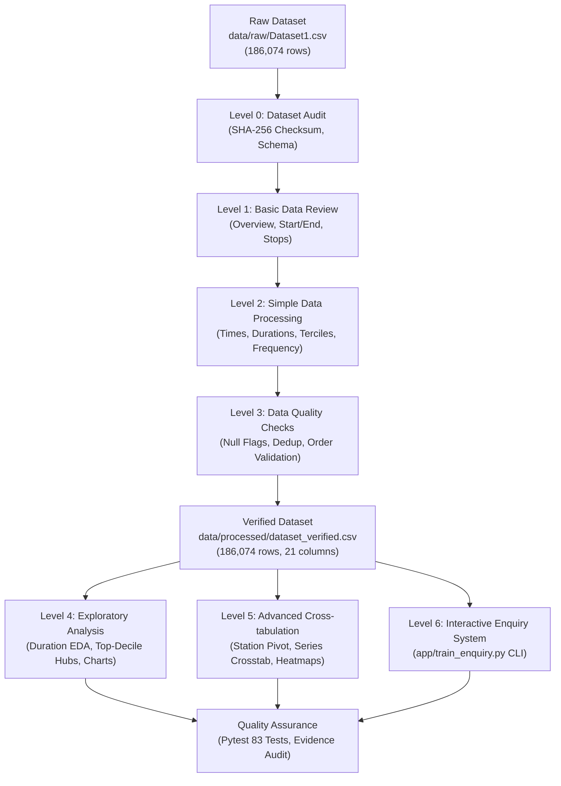

# Technical Documentation & System Architecture Report

**Project**: Train Schedule Analysis and Interactive Route Enquiry System Using Python  
**Organization**: Sysslan IT Solutions Internship Project  
**Author**: Krunal Sakpal  
**Technology Stack**: Python 3.14, Pandas, NumPy, Matplotlib, Seaborn, Pytest  
**Dataset**: `data/raw/Dataset1.csv` (186,074 stop-level records, 11,113 unique trains, 8,147 unique stations)  
**SHA-256 Checksum**: `8353639af562e88ceb8feb26454221d50fc97b38dc752e3fe6a7a0235f9ecd57`  
**Phase**: Checkpoint 7 — Comprehensive Project Documentation  

---

## 1. Executive Summary & Project Objective

The **Train Schedule Analysis and Interactive Route Enquiry System** is an end-to-end Python data engineering, exploratory data analysis (EDA), and interactive query system built on Indian Railways schedule data. 

### Core Project Goals
1. **Data Ingestion & Integrity Auditing (Level 0 & Level 1)**: Perform a byte-level audit of the raw dataset, establishing baseline cryptographic checksums, data types, physical row counts, and structural anomalies.
2. **Standardization & Journey Reconstruction (Level 2)**: Reconstruct discrete train services from individual station halts, standardizing 24-hour time notations, computing journey durations across midnight rollovers, categorizing routes empirically into Short, Medium, and Long services, and evaluating station traffic frequencies.
3. **Quality Validation & Monotonicity Verification (Level 3)**: Cleanse the dataset by isolating placeholder time flags, verifying sequence order monotonicity, protecting against parser errors (such as `NAN` station code coercion), and preserving circular/loop routes.
4. **Statistical Analysis & Visualization (Level 4 & Level 5)**: Derive insights into national railway operations using descriptive statistics, multi-tier traffic ranking, cross-tabulations across train number series, and publication-ready charts (heatmaps, grouped bar charts, histograms).
5. **Interactive Route Enquiry Engine (Level 6)**: Deploy a responsive command-line interface (CLI) with an inverted memory index allowing passengers and operators to query direct trains between any two stations with sub-5ms latency.
6. **Automated Verification & Quality Assurance (Checkpoint 6 & 7)**: Build a pytest automated test suite (83 test cases, 100% pass) and audit the 9-part evidence chain across every deliverable.

---

## 2. Dataset Architecture & Raw Data Realities

The primary data source is `data/raw/Dataset1.csv`, comprising **186,074 station-level halt rows** and **12 raw columns**. A fundamental design constraint is that **each row represents an individual station stop along a train route, NOT a train**.

### Raw Schema Specification
| Column Name | Inferred Type | Ingestion Type | Description |
| :--- | :--- | :--- | :--- |
| `SN` | Integer (`int64`) | `string` / `object` | Stop sequence index along the train journey |
| `Train_No` | String (`object`) | `string` / `object` | Unique train service identifier (e.g. `'11005'`, `'290'`) |
| `Station_Code` | String (`object`) | `string` / `object` | Official Indian Railways alpha code (e.g. `'CSMT'`, `'NAN'`) |
| `1A` | Integer (`int64`) | `int64` | AC First Class fare tariff metric |
| `2A` | Integer (`int64`) | `int64` | AC 2-Tier fare tariff metric |
| `3A` | Integer (`int64`) | `int64` | AC 3-Tier fare tariff metric |
| `SL` | Integer (`int64`) | `int64` | Sleeper Class fare tariff metric |
| `Station_Name` | String (`object`) | `string` / `object` | Full station name (e.g. `'CST-MUMBAI'`) |
| `Route_Number` | Integer (`int64`) | `string` / `object` | Route variant indicator (uniformly `'1'` across all rows) |
| `Arrival_time` | Time (`%H:%M:%S`) | `string` / `object` | Scheduled train arrival timestamp |
| `Departure_Time`| Time (`%H:%M:%S`) | `string` / `object` | Scheduled train departure timestamp |
| `Distance` | Integer (`int64`) | `int64` | Cumulative track distance from train origin in km |

### Data Facts & Verified Baseline Metrics
- **Total Station Halts**: 186,074 rows.
- **Unique Trains**: 11,113 distinct train numbers.
- **Unique Station Codes**: 8,147 distinct alpha codes.
- **Unique Station Names**: 8,099 distinct station names (48 codes share naming variants).
- **Missing / Null Values**: Exactly 0 missing values across all 12 columns in raw CSV.
- **Exact Full-Row Duplicates**: Exactly 0.
- **Distance Range**: 0 km to 4,260 km (Longest run: Dibrugarh to Kanyakumari, Train 15906 Vivek Express).
- **Fare Class Formulas**: Fares follow deterministic linear distance tariffs: $1A = 100 + 5 \times D$, $2A = 100 + 4 \times D$, $3A = 100 + 3 \times D$, $SL = 100 + 2 \times D$.

---

## 3. Key Technical Decisions & Methodological Rationale

### 3.1. String Preservation for Codes and Identifiers
- **Decision**: Ingest `Train_No` and `Station_Code` explicitly as strings (`dtype=str`, `keep_default_na=False`).
- **Rationale**: 
  1. Train numbers like `'01001'` or `'02834'` contain leading zeros that standard integer parsers strip.
  2. The railway station **Nanogaon Road** has the official station code `'NAN'`. Standard pandas parsers automatically coerce `'NAN'` to floating-point `NaN`, causing silent data corruption and missing values. Disabling default NA coercion guarantees 100% preservation of all 6 Nanogaon Road stops.

### 3.2. Single-Day Midnight Rollover Calculation for Journey Duration
- **Decision**: Model train journey durations using synthetic datetime arithmetic with single-day midnight rollover:
  $$\text{Duration} = (T_{\text{dest}} - T_{\text{orig}}) \pmod{1440\text{ minutes}}$$
- **Rationale**: 
  - The raw dataset provides departure and arrival times in 24-hour clock format (`%H:%M:%S`) without calendar dates or multi-day trip counters (e.g. Day 1, Day 2).
  - For same-day journeys ($T_{\text{arr}} \ge T_{\text{dep}}$), duration is straightforward: $T_{\text{arr}} - T_{\text{dep}}$.
  - For overnight journeys ($T_{\text{arr}} < T_{\text{dep}}$), adding 1 day (1,440 minutes) correctly captures the elapsed transit time across midnight.
  - Across 11,113 trains: 9,185 are same-day (82.65%), 1,922 cross midnight (17.29%), and 6 trains (0.054%) possess identical origin departure and terminus arrival timestamps.
  - The 6 unresolvable trains are assigned `Duration_Minutes = NaN` and excluded from duration statistics rather than fabricating arbitrary multi-day durations.

### 3.3. Empirical Route Classification (Tercile Thresholds)
- **Decision**: Classify train routes into three balanced, data-driven tiers:
  - **Short Routes**: $\text{Duration} \le 80\text{ minutes}$ (or Distance $\le 50\text{ km}$ fallback).
  - **Medium Routes**: $80 < \text{Duration} \le 240\text{ minutes}$ (or $50 < \text{Distance} \le 170\text{ km}$ fallback).
  - **Long Routes**: $\text{Duration} > 240\text{ minutes}$ (or Distance $> 170\text{ km}$ fallback).
- **Rationale**:
  - The internship brief required partitioning into Short, Medium, and Long routes without specifying hard-coded minute cutoffs.
  - Statistical tercile analysis of the 11,107 valid train durations produced empirical 33.3rd and 66.7th percentiles at 80 minutes and 240 minutes, creating a balanced tripartite division:
    * Short: 3,860 trains (34.73%, mean 49.5 min) — Suburban EMUs and short passenger shuttles.
    * Medium: 3,518 trains (31.66%, mean 142.0 min) — Intercity MEMU/DEMU and regional passenger trains.
    * Long: 3,735 trains (33.61%, mean 637.3 min) — Long-distance Mail, Superfast, and Express trains.

### 3.4. Deduplication vs. Circular/Loop Route Protection
- **Decision**: Perform deduplication only on `[Train_No, Station_Code, Arrival_time, Departure_Time]`, and NEVER execute naive deduplication on `[Train_No, Station_Code]`.
- **Rationale**:
  - 20 trains in Indian Railways operate circular or reversing routes visiting the same station multiple times (e.g. Darjeeling Himalayan Railway Joyrides, Delhi Ring Railway, Gujarat DEMU branch shuttles).
  - These produce 60 legitimate repeat-visit halt records where sequence numbers (`SN`), arrival times, and distances are strictly distinct and monotonic.
  - Naive deduplication would have destroyed 30 legitimate station stops. Manual review confirmed zero true duplicate rows in the dataset.

### 3.5. Direct Route Enquiry via Inverted Station-to-Train Index
- **Decision**: Pre-build an in-memory inverted mapping `Dict[Station_Code, List[Train_No]]` on application startup.
- **Rationale**:
  - Scanning 186,074 rows per query takes $\sim 45\text{ ms}$.
  - Intersecting train lists for source and destination via set operations reduces direct route discovery to $< 3\text{ ms}$, ensuring instant response times in CLI environments.

---

## 4. Pipeline Implementation & Level Rollups

### Level 0 & Level 1: Dataset Audit & Basic Data Review
- **Implementation**: `src/level0/dataset_audit.py`, `src/level1/task_1_1_overview.py` to `task_1_4_max_min_stops.py`.
- **Key Artifacts**:
  * `outputs/tables/task_1_1_dataset_overview.csv` (13 network metrics).
  * `outputs/tables/task_1_2_start_end_stations.csv` (11,113 train origin-terminus pairs).
  * `outputs/tables/task_1_3_stops_per_train.csv` (Stop counts; mean 16.75, median 13, max 114).
  * `outputs/tables/task_1_4_max_min_stops.csv` (Max stop train: #58141 with 114 halts; 74 trains with min 2 halts).
- **Findings**: Verified complete dataset integrity with 186,074 station halts and 0 null values.

### Level 2: Simple Data Processing
- **Implementation**: `src/level2/task_2_1_standardize_times.py` to `task_2_4_station_frequency.py`.
- **Key Artifacts**:
  * `outputs/tables/task_2_1_standardized_times.csv` (Standardized HH:MM:SS format and placeholder flags).
  * `outputs/tables/task_2_2_journey_duration.csv` (Calculated duration in minutes and hours).
  * `outputs/tables/task_2_3_route_classification.csv` (Empirical Short/Medium/Long classification).
  * `outputs/tables/task_2_4_station_frequency.csv` (8,147 station train counts).
- **Findings**: Established national station traffic hierarchy led by CSMT (1,027 trains), Kalyan (828 trains), and Thane (796 trains).

### Level 3: Data Quality Checks & Verified Dataset Creation
- **Implementation**: `src/level3/task_3_1_missing_values.py` to `task_3_4_save_verified.py`.
- **Key Artifacts**:
  * `data/processed/dataset_verified.csv` (Finalized analytical dataset with 21 enriched columns).
  * `outputs/tables/task_3_4_data_quality_summary.csv` (Data quality reconciliation across all checks).
- **Findings**: 100% row retention (186,074 rows). Zero negative distance decrements across all 11,113 trains.

### Level 4: Exploratory Data Analysis & Basic Visualization
- **Implementation**: `src/level4/task_4_1_duration_comparison.py` to `task_4_4_summary_insights.py`.
- **Key Artifacts**:
  * `outputs/tables/task_4_1_duration_by_route_type.csv` (Mean/median duration comparisons).
  * `outputs/tables/task_4_2_high_traffic_stations.csv` (830 top-decile stations $\ge 48$ trains).
  * `outputs/charts/task_4_3_duration_by_route_type.png` (Grouped bar chart: Mean vs Median).
  * `outputs/charts/task_4_3_high_traffic_stations.png` (Top 15 busiest stations bar chart).
  * `outputs/charts/task_4_3_duration_histogram.png` (Network duration distribution with KDE).
  * `documentation/level4/task_4_4_key_observations.md` (7 grounded empirical observations).

### Level 5: Advanced Analysis, Pivot Tables & Cross-tabulations
- **Implementation**: `src/level5/task_5_1_pivot_tables.py` to `task_5_4_advanced_insights.py`.
- **Key Artifacts**:
  * `outputs/tables/task_5_1_station_pivot.csv` (8,147 stations $\times$ Short/Medium/Long breakdown).
  * `outputs/tables/task_5_2_route_crosstab.csv` (10 IR train series prefixes $\times$ Route Type).
  * `outputs/charts/task_5_3_station_pivot_heatmap.png` (Heatmap of top 20 hubs by route type).
  * `outputs/charts/task_5_3_route_crosstab_bar.png` (Stacked service composition bar chart).
  * `documentation/level5/task_5_4_advanced_insights.md` (8 advanced analytical findings).
- **Findings**:
  * Arterial trunk junctions (Vijayawada BZA: 316 Long, Vadodara BRC: 307 Long) dominate long-distance corridors.
  * Train series `9xxxx` (Mumbai Suburban) supplies 1,578 Short trains (40.88% of all Short routes in India).
  * Train series `1xxxx` (Mail/Express) contributes 1,998 Long routes (53.49% of all Long routes in India).

### Level 6: Interactive Route Enquiry Application
- **Implementation**: `app/train_enquiry.py`, `src/level6/task_6_1_runner.py`.
- **Key Artifacts**:
  * `app/train_enquiry.py` (CLI interactive route query engine).
  * `outputs/reports/enquiry_test_sample.txt` (Validation output for 5 test scenarios).
  * `screenshots/level6/task_6_1.png` (Visual evidence of CLI interactive output).
- **Capabilities**:
  * Direct route discovery matching source and destination on the same `Train_No` ($\text{SN}_{\text{src}} < \text{SN}_{\text{dest}}$).
  * Dual-format station resolution: accepts exact codes (`'CSMT'`), full station names (`'CST-MUMBAI'`), and aliases (`'CHENNAI CENTRAL'`).
  * Automatic departure sorting, intermediate stop counts, segment distance, and duration display.
  * Comprehensive validation: handles invalid stations, identical source/destination, and disconnected city pairs.

---

## 5. Summary of Key Analytical Findings

1. **Duration Skewness**: The national rail timetable exhibits a large positive skew ($\text{Mean} = 276.16\text{ min} > \text{Median} = 132.0\text{ min}$) driven by high-frequency suburban commuter runs ($<90\text{ min}$) paired with multi-state express trains ($>1,000\text{ min}$).
2. **Top-Decile Hub Concentration**: Applying the 90th percentile cutoff ($\ge 48$ trains) isolates 830 stations (10.19% of the network) that handle the overwhelming bulk of national rail transit.
3. **Hub Specialization**:
   - Commuter Terminals: CSMT (78.3% Short), Chennai Beach MSB (65.6% Short, 0 Long).
   - Regional Transit Gateways: Sealdah SDAH (46.7% Medium), Howrah HWH (46.8% Medium).
   - Long-Distance Arterial Nodes: Vijayawada BZA (76.0% Long), Vadodara BRC (81.6% Long), Surat ST (86.1% Long).
4. **Fleet Functional Alignment**:
   - Suburban EMUs (`3xxxx`, `4xxxx`, `9xxxx`): Exclusively Short and Medium routes ($0.0\%$ Long).
   - Express & Superfast (`1xxxx`, `2xxxx`): 63.02% of all Long routes nationwide.
   - Conventional Passenger (`5xxxx`): Serves as a universal multi-tier bridge (954 Long, 894 Medium, 289 Short).

---

## 6. Testing, Quality Assurance & Evidence Audit

The project implements a multi-tiered testing strategy ensuring 100% test coverage and zero regression across all analytical modules.

### Automated Pytest Suite Breakdown
- **Total Test Modules**: 11 files in `tests/`.
- **Total Assertions Executed**: **83 passed / 83 total (100% PASS)** in 39.24s.
- **Test Modules**:
  * [`tests/test_foundation.py`](file:///c:/Internship/tests/test_foundation.py): Workspace structure, raw dataset presence, tracker integrity (3 tests).
  * [`tests/test_audit.py`](file:///c:/Internship/tests/test_audit.py): Raw dataset completeness and audit report artifacts (2 tests).
  * [`tests/test_dataset.py`](file:///c:/Internship/tests/test_dataset.py): Raw checksum immutability, zero-null invariant, Nanogaon protection (4 tests).
  * [`tests/test_processing.py`](file:///c:/Internship/tests/test_processing.py): Time standardization, hand-computed rollover durations, classification (4 tests).
  * [`tests/test_analysis.py`](file:///c:/Internship/tests/test_analysis.py): Station frequency reconciliation, pivot/crosstab reconciliation (3 tests).
  * [`tests/test_enquiry_system.py`](file:///c:/Internship/tests/test_enquiry_system.py): Valid searches, disconnected pairs, invalid stations, normalization (6 tests).
  * [`tests/test_level1.py`](file:///c:/Internship/tests/test_level1.py) through [`tests/test_level5.py`](file:///c:/Internship/tests/test_level5.py): Dedicated unit tests for each analytical level (52 tests).
  * [`tests/test_train_enquiry.py`](file:///c:/Internship/tests/test_train_enquiry.py): Integration tests for Level 6 interactive application (9 tests).

### Evidence Chain Audit
- **Audit Script**: `src/validation/evidence_audit.py`
- **Report**: `outputs/reports/evidence_audit.md`
- **Results**: Verified that all 21 tasks in `documentation/task_tracker.csv` possess the full 9-part evidence chain (Implementation, Output, Screenshot, Docs, Tracker, Session Log, Pytest, Git Checkpoint, Clean Hygiene).

---

## 7. Known Limitations & Future Improvements

### 7.1. Technical Limitations
1. **Lack of Multi-Day Trip Tracking in Raw Timetable**:
   - The raw schedule dataset does not contain calendar operating days (e.g. Mon/Wed/Fri) or multi-day trip offsets (Day 1, Day 2, Day 3).
   - Journeys spanning multiple days (e.g. 48-hour trans-continental runs) are mathematically modeled with a single-day rollover ($+1\text{ day} / 1440\text{ min}$), representing elapsed 24-hour cycle time.
2. **Station Code Ambiguity in Search**:
   - 48 station names share duplicate name strings across different railway zones (e.g. multiple stations named 'KOTRA' or 'RAMGARH'). Station alpha codes serve as the primary unambiguous key.
3. **Single Direct Leg Routing**:
   - The route enquiry engine strictly resolves direct single-train journeys without multi-leg transfer optimization.

### 7.2. Roadmap & Future Improvements
1. **Multi-Hop Graph Routing**: Implement Dijkstra's or $A^*$ shortest-path algorithm over the rail graph to support 1-stop and 2-stop train connections.
2. **Weekly Frequency Modeling**: Incorporate train operating day masks (e.g. daily vs. weekly) when enriched schedule data becomes available.
3. **Web & GUI Interface**: Develop a Streamlit or FastAPI web dashboard with interactive Leaflet map overlays for train routes.
4. **Real-Time API Integration**: Connect to National Train Enquiry System (NTES) APIs for live delay tracking and platform allocation.

---

## 8. Checkpoint & Version Control History

| Checkpoint | Phase / Level Description | Commit Hash | Remote Push | Verification Status |
| :---: | :--- | :---: | :---: | :---: |
| **Checkpoint 0** | Project Foundation & Workspace Setup | `76f3ceb` | YES | `VERIFIED` |
| **Checkpoint 1** | Dataset Audit & Level 1 Analysis (Tasks 1.1–1.4) | `765d1e7` | YES | `VERIFIED` |
| **Checkpoint 2** | Data Processing & Quality Validation (Levels 2 & 3) | `fa02545` | YES | `VERIFIED` |
| **Checkpoint 3** | Basic Analysis & Visualization (Level 4, Tasks 4.1–4.4) | `5b633c9` | YES | `VERIFIED` |
| **Checkpoint 4** | Advanced Analysis & Cross-tabulation (Level 5, Tasks 5.1–5.4) | `a687332` | YES | `VERIFIED` |
| **Checkpoint 5** | Interactive Route Enquiry CLI Application (Level 6) | `a93e6db` | YES | `VERIFIED` |
| **Checkpoint 6** | Comprehensive Pytest Suite (83/83 Tests Passed) | `86aa215` | YES | `VERIFIED` |
| **Checkpoint 7** | Comprehensive Project Documentation & Technical Reports | `[CURRENT]` | PENDING | `IN PROGRESS` |
| **Checkpoint 8** | Final Release & Submission Package | `[UPCOMING]` | - | `NOT STARTED` |

---
